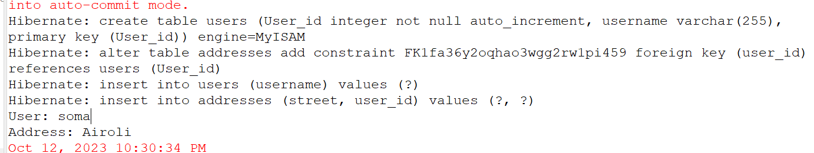
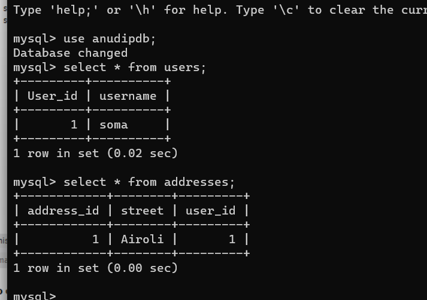

# OneToOneHibernate
This repository serves as an example of a one-to-one relationship in Hibernate between User and Address entities. It illustrates how users can have a single associated address and vice versa, providing a fundamental demonstration of database relationships using Hibernate.

